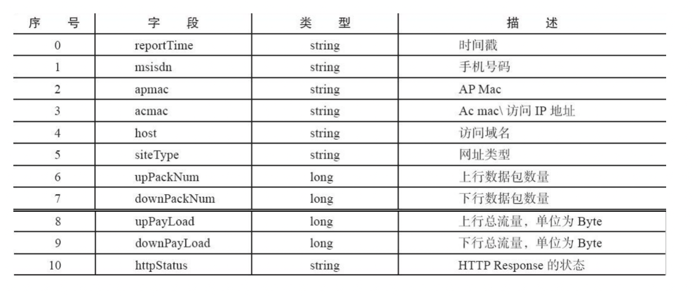
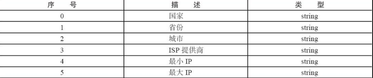
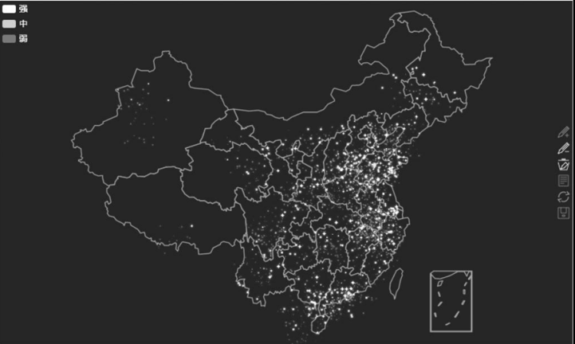

# Storm_Project

#### 介绍
大三下大数据学期项目

#### 项目整体要求

- 项目的主旨是使用STORM的实时计算，对给出的数据进行分析。
- 实现“语音实时地图展示”。
- 将分析所得数据结果进行数据可视化。
#### 使用说明

1.  在宝塔Mysql新建表Location、InvalidCity
2.  Kafka新建Topic:test1
3.  安装Hadoop、Storm、Kafka
4.  启动服务 发布Topology
5.  启动生产者实例将数据放入消息队列

#### 功能需求

1.  “语音实时地图展示”项目的需求是将用户登录的地点实时显示在地图上，数据量为每天一亿，每秒峰值20000（此次项目是对这一秒的样本数据进行处理），要求系统具备高可靠性。
2.  数据字典：
    - 手机APP访问日志数据见文件app.log，数据中共有11个字段，字段之间的分隔符为\t。

    
    - 地区和IP地址的对应关系数据见文件ip_area_isp.txt，数据中共有6个字段，字段之间的分隔符为\t。
    
    - 地区和经纬度的对应关系数据见文件lng-lat-mapping.txt，数据中共有3个字段，字段之间的分隔符为\t。
    
3.  Storm的拓扑图：根据业务要求，设计合理的Storm的Topology的拓扑图
4.  接收数据源：接收手机APP产生的实时日志信息。
5. 对数据源进行实时处理：将APP的日志信息中的网络IP字段提取出来将其转换为地址，再将地址转换为具体的经纬度，数据落地在MySQL数据库中，然后通过调用ECharts或者积木报表地图API获得地图页面，根据获得的数据在地图上展示相应的地理位置。
6. 通过图形化展示，对数据进行结果的分析总结

实例结果：
   
